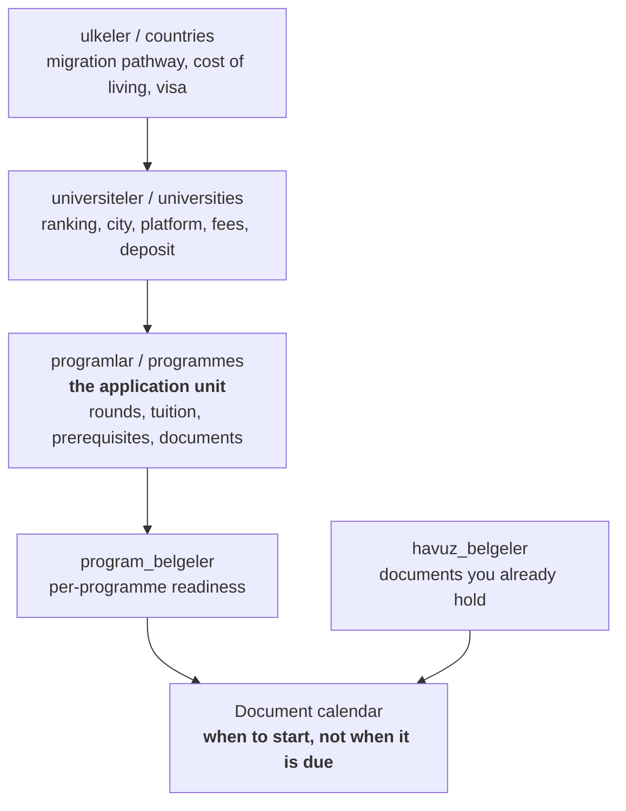

# Program Takip

[](https://github.com/FlyerFukas/programtakip/actions/workflows/dogrula.yml)
[](LICENSE)
[](https://nextjs.org/)
[](https://www.typescriptlang.org/)
[](https://neon.tech/)

**A master's application tracker built around the deadline that actually binds you.**

Most European universities close applications for non-EU/EEA applicants weeks
or months before EU applicants. The date printed largest on the programme page
is usually the EU one. Program Takip stores both rounds separately and counts
down to yours.

Built for a single applicant tracking dozens of programmes across countries.
It is not a CRM and it is not multi-tenant. It is a personal notebook with a
schema.

> 🇹🇷 Türkçe sürüm: [README.tr.md](README.tr.md) · **The interface is in Turkish.**

---

## Why it exists

A scholarship tracker answers one question: what will they give me? A
programme tracker has to answer three harder ones.

**Will I even be eligible?** Programmes carry prerequisites: at least 30 ECTS
of mathematics, a bachelor's in economics or a related field, demonstrated
programming experience. Finding out after you apply costs a year.

**What does it really cost?** Tuition in DKK, living costs in SEK, a deposit
in CAD. Nobody compares those in their head.

**Can I stay afterwards?** A highly ranked programme in a country with no
post-study work permit is, for some applicants, a bad programme.

---

## What it does

### Application rounds, not a single deadline

A programme can carry several rounds (`non-EU`, `EU`, `everyone`), each with
its own date. The countdown uses the earliest date that actually binds you.
EU rounds still appear, drawn dimmed, and never drive the badge.

### Eligibility gate

Prerequisites are stored as a fixed vocabulary (maths ECTS, statistics course,
programming, country language and so on) so you can filter by them. The
verdict of eligible, doubtful or ineligible is marked by hand on purpose: it
needs your transcript, and a guess would manufacture false confidence.

### Migration pathway, per country

Post-study work permit, years to permanent residence, language requirement,
property restrictions, dual citizenship, return obligation. Stored on the
country and shared by every programme under it.

### True cost in one currency

Tuition, living costs, application fee and deposit, minus any expected
scholarship, normalised to EUR. Missing data is never counted as zero. An
unpriced item is reported as missing, because showing a 40,000 EUR programme
as 20,000 EUR breaks the very decision the total exists to support.

### Document calendar

Five programmes asking for the same transcript is one task, due at the
earliest of the five. Each document carries a preparation time (IELTS around
90 days, credential evaluation around 90, references around 30), so rows show
**when to start**, not when it is due. A valid document already in your pool
costs 3 days instead of 90.

### AI-assisted entry

Paste a programme page or drop a `.docx`. Claude or Gemini fills the form and
flags whatever it was unsure about. Every field the model returns is validated
against the code lists, so invented values are dropped before they reach the
database. Both keys are optional: without them the app works fully and you
type the fields yourself.

### Everyday things

Filter state lives in the URL, including relative dates (`?son=+30` stays
correct every day). Installable as a PWA, light and dark themes, JSON backup
and restore.

---

## Architecture



Three layers, because a university's city, ranking, application platform and
fees are shared by every programme under it. Flattening them would mean
retyping the same facts for each programme, and editing five rows to correct
one.

| Layer | Choice | Reason |
|---|---|---|
| Framework | Next.js 15 App Router, React 19 | Server Actions are the only write path |
| Language | TypeScript, `strict` | field names mirror DB columns 1:1, no mapping layer |
| Database | Neon serverless Postgres, raw SQL | no ORM; queries stay readable and the schema is the single source of truth |
| Styling | hand-written CSS design system | no Tailwind; one `globals.css`, themed with CSS variables |
| Auth | one password plus an HMAC-signed cookie | no accounts, no session table; every write action calls `oturumZorunlu()` first |

Naming is Turkish throughout: variables, files and database columns
(`lib/tarih.ts`, `programKaydet`, `son_tarih_tipi`). Deliberate and consistent.

Design decisions and the reasoning behind them live in [PROJE.md](PROJE.md),
which is the file the code comments cite by section number.

---

## Quick start

Requires **Node.js 20+** and a free [Neon](https://neon.tech/) database.

```bash
git clone https://github.com/FlyerFukas/programtakip.git
cd programtakip
npm install
cp .env.local.example .env.local   # then fill DATABASE_URL
npm run gizli                      # generates APP_PAROLA and OTURUM_GIZLI
npm run sema                       # applies veritabani/sema.sql
npm run dev                        # http://localhost:3200
```

Step by step setup, including where to click in the Neon console:
[BASLA.md](BASLA.md).

A missing environment variable does not crash the app. `/kurulum` reports
exactly which one is absent, which is what made the first deploy diagnosable.

### Environment

| Variable | Required | Purpose |
|---|---|---|
| `DATABASE_URL` | yes | Neon Postgres connection string, server-side only |
| `APP_PAROLA` | yes | login password |
| `OTURUM_GIZLI` | yes | signs the session cookie, 32+ chars |
| `ANTHROPIC_API_KEY` | optional | AI parsing via Claude |
| `GEMINI_API_KEY` | optional | AI parsing via Gemini |
| `ANTHROPIC_MODEL` / `GEMINI_MODEL` | optional | override model names without redeploying |
| `NEXT_PUBLIC_BURS_APP_URL` | optional | link programmes to a separate scholarship app |

---

## Verification

```bash
npm run dogrula   # 185 rule tests + 55 parser tests + field coverage
npm run sina      # database smoke test, 38 checks
```

Everything except `sina` runs offline, which is why CI can run the whole suite
with no database and no API keys.

**Rule tests** cover date logic, round selection, the document calendar,
filters and currency conversion. They are built relative to today, so they do
not quietly rot into meaninglessness.

**Parser tests** cover the filter layer between the model and the database.
Its job is rejecting bad model output: invented option codes, impossible
dates, negative quotas.

**Field coverage** is a static check that every field enterable in a form is
rendered on the matching detail page. It exists because a note field was once
nested inside another field's conditional and silently never appeared.
Exemptions are allowed, but each one requires a written reason.

---

## Deployment

Import the repository on Vercel, set the environment variables, deploy. Every
push to `main` triggers a deployment.

Two things worth knowing before you lose an afternoon to them:

1. Environment variables are read at build time, so adding one requires a
   redeploy. For `NEXT_PUBLIC_` variables it has to be a redeploy with the
   build cache disabled, since those values are inlined into the bundle.
2. On Vercel a `NEXT_PUBLIC_` variable cannot be marked Secret or Sensitive.
   The API rejects it as `invalid_visibility`, and the dashboard drops it
   silently.

---

## License

[MIT](LICENSE) © Furkan Akduman
