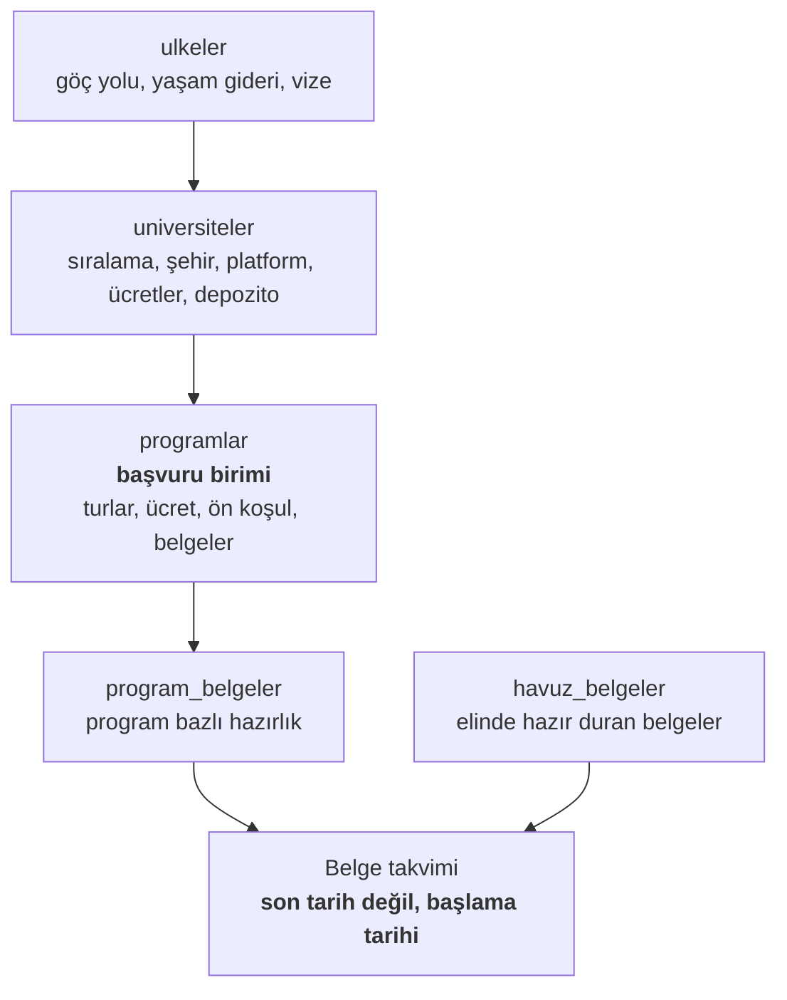

# Program Takip

[](https://github.com/FlyerFukas/programtakip/actions/workflows/dogrula.yml)
[](LICENSE)
[](https://nextjs.org/)
[](https://www.typescriptlang.org/)
[](https://neon.tech/)

**Yüksek lisans başvurularını, seni gerçekten bağlayan tarihe göre takip eden
bir uygulama.**

Avrupa üniversitelerinin çoğunda AB/AEA dışı başvuru, AB başvurusundan
haftalar hatta aylar önce kapanıyor. Program sayfasında en büyük puntoyla
yazan tarih ise genelde AB tarihi. Program Takip iki turu ayrı tutuyor ve
geri sayımı senin turuna göre yapıyor.

Tek bir başvuru sahibinin onlarca programı takip etmesi için yazıldı. CRM
değil, çok kullanıcılı değil. Şeması olan kişisel bir not defteri.

> 🇬🇧 English version: [README.md](README.md)

---

## Neden var

Bir burs takipçisi tek soruya cevap verir: bana ne verecekler? Program
takipçisi üç zor soruya cevap vermek zorunda.

**Zaten uygun muyum?** Programların ön koşulları var: en az 30 ECTS matematik,
ekonomi ya da ilgili bir lisans, kanıtlanmış programlama bilgisi. Bunu
başvurduktan sonra öğrenmek bir yıla mal oluyor.

**Gerçekte kaça mal oluyor?** Öğrenim ücreti DKK, yaşam gideri SEK, depozito
CAD. Bunları kimse kafadan karşılaştıramaz.

**Sonrasında kalabilir miyim?** Sıralaması yüksek ama mezuniyet sonrası
çalışma izni vermeyen bir program, bazı adaylar için kötü bir programdır.

---

## Ne yapıyor

### Tek son tarih değil, başvuru turları

Bir programda birden fazla tur olabilir (`AB dışı`, `AB`, `herkes`), her biri
kendi tarihiyle. Geri sayım seni fiilen bağlayan en erken tarihe göre çalışır.
AB turları yine görünür, soluk çizilir ve rozeti asla sürüklemez.

### Uygunluk kapısı

Ön koşullar sabit bir sözlükle kaydediliyor (matematik ECTS, istatistik dersi,
programlama, ülke dili gibi), böylece süzülebiliyorlar. Uygun, şüpheli ya da
uygun değil kararı bilerek elle işaretleniyor: transkript gerektiriyor ve
tahmin yanlış güven üretir.

### Ülke bazlı göç yolu

Mezuniyet sonrası çalışma izni, daimî oturuma kaç yıl, dil şartı, mülk kısıtı,
çifte vatandaşlık, dönüş yükümlülüğü. Ülkede tutuluyor ve altındaki bütün
programlar paylaşıyor.

### Tek para biriminde gerçek maliyet

Öğrenim ücreti, yaşam gideri, başvuru ücreti ve depozito, varsa beklenen burs
düşülerek EUR'ya normalleştiriliyor. Eksik veri asla sıfır sayılmıyor. Fiyatı
girilmemiş kalem "eksik" olarak bildiriliyor, çünkü 40.000 EUR'luk bir
programı 20.000 EUR göstermek, toplamın var olma sebebi olan kararı bozar.

### Belge takvimi

Aynı transkripti isteyen beş program tek bir iştir ve beşinin en erken
tarihine yetişmesi gerekir. Her belgenin hazırlık süresi var (IELTS yaklaşık
90 gün, denklik yaklaşık 90, referans yaklaşık 30), bu yüzden satırlar son
tarihi değil **ne zaman başlaman gerektiğini** gösteriyor. Havuzunda geçerli
hâliyle duran bir belge 90 gün değil 3 gün yiyor.

### Yapay zekâ destekli giriş

Program sayfasını yapıştır ya da `.docx` bırak. Claude veya Gemini formu
doldurur ve emin olamadığı yerleri işaretler. Modelin döndürdüğü her alan kod
listelerine karşı doğrulanır, uydurulmuş değerler veritabanına ulaşmadan
atılır. İki anahtar da isteğe bağlı: onlarsız uygulama tam çalışır, alanları
kendin yazarsın.

### Gündelik şeyler

Süzgeç durumu URL'de duruyor, göreli tarihler dahil (`?son=+30` her gün doğru
kalır). PWA olarak kurulabiliyor, açık ve koyu tema var, JSON yedek alma ve
geri yükleme çalışıyor.

---

## Mimari



Üç katman, çünkü bir üniversitenin şehri, sıralaması, başvuru platformu ve
ücretleri altındaki bütün programlar için ortak. Düzleştirmek, aynı bilgiyi
her program için yeniden yazmak ve tek bir düzeltme için beş satır
değiştirmek olurdu.

| Katman | Seçim | Gerekçe |
|---|---|---|
| Çatı | Next.js 15 App Router, React 19 | tek yazma yolu Server Action |
| Dil | TypeScript, `strict` | alan adları DB sütunlarıyla birebir, eşleme katmanı yok |
| Veritabanı | Neon serverless Postgres, düz SQL | ORM yok; sorgular okunabilir kalıyor, şema tek kaynak |
| Görünüm | elle yazılmış CSS tasarım sistemi | Tailwind yok; tek `globals.css`, CSS değişkenleriyle temalı |
| Erişim | tek parola ve HMAC imzalı çerez | hesap yok, oturum tablosu yok; yazan her action `oturumZorunlu()` ile başlar |

İsimlendirme baştan sona Türkçe: değişkenler, dosyalar ve veritabanı sütunları
(`lib/tarih.ts`, `programKaydet`, `son_tarih_tipi`). Bilinçli ve tutarlı.

Tasarım kararları ve gerekçeleri [PROJE.md](PROJE.md) içinde; koddaki yorumlar
o dosyaya bölüm numarasıyla atıf yapıyor.

---

## Hızlı başlangıç

**Node.js 20+** ve ücretsiz bir [Neon](https://neon.tech/) veritabanı gerekiyor.

```bash
git clone https://github.com/FlyerFukas/programtakip.git
cd programtakip
npm install
cp .env.local.example .env.local   # DATABASE_URL'i doldur
npm run gizli                      # APP_PAROLA ve OTURUM_GIZLI üretir
npm run sema                       # veritabani/sema.sql dosyasını uygular
npm run dev                        # http://localhost:3200
```

Neon panelinde nereye tıklayacağın dahil adım adım kurulum:
[BASLA.md](BASLA.md).

Eksik bir ortam değişkeni uygulamayı çökertmiyor. `/kurulum` hangisinin eksik
olduğunu tam olarak söylüyor.

---

## Doğrulama

```bash
npm run dogrula   # 185 kural + 55 ayrıştırıcı testi + alan kapsama
npm run sina      # veritabanı duman testi, 38 kontrol
```

`sina` dışındaki her şey çevrimdışı çalışıyor; CI'ın tüm takımı veritabanı ve
API anahtarı olmadan koşabilmesinin sebebi bu.

**Kural testleri** tarih mantığını, tur seçimini, belge takvimini, süzgeçleri
ve kur çevrimini kapsıyor. Bugüne göre kurulular, yani sessizce anlamsızlaşıp
çürümüyorlar.

**Ayrıştırıcı testleri** model ile veritabanı arasındaki süzme katmanını
kapsıyor. Bu katmanın işi modelin kötü çıktısını reddetmek: uydurulmuş kodlar,
imkânsız tarihler, negatif kontenjan.

**Alan kapsama denetimi**, formda girilebilen her alanın ilgili detay
sayfasında çizildiğini statik olarak doğrular. Var olma sebebi: bir not alanı
bir kez başka alanın koşuluna gömülü kalmış ve sessizce hiç görünmemişti.
Muafiyet serbest ama her biri için yazılı gerekçe zorunlu.

---

## Lisans

[MIT](LICENSE) © Furkan Akduman
